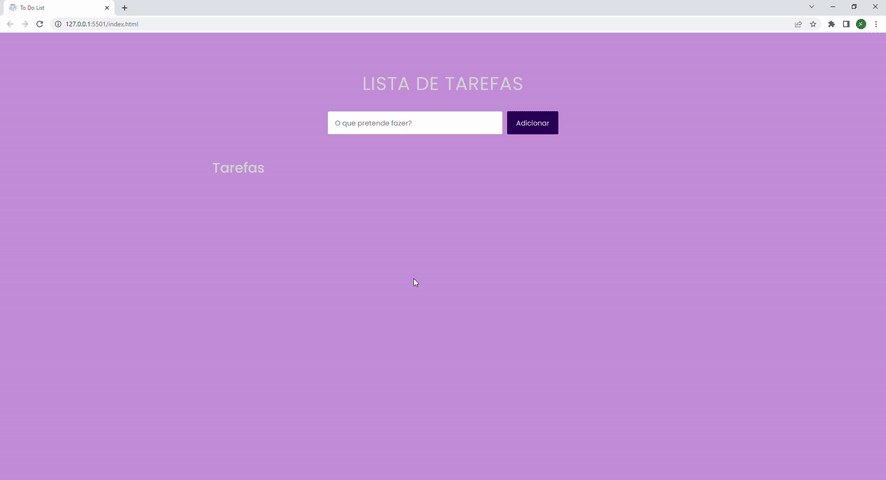

<h1 align="center">TO DO LIST</h1>

> 🔎 Lista de tarefas dinâmica e simples de usar, adicione, exclua e complete suas tarefas com facilidade.  
🗔 Confira a aplicação: https://klausmorotti.github.io/lista-de-tarefas/  

## 📄 Explicação

Quem hoje em dia não gosta de uma boa gestão de tempo e organização? rsrs

Justamente pra isso o projeto Lista de tarefas foi criado, um projeto dinâmico e objetivo com funções de registrar, completar e excluir tarefas diárias

O projeto contém as seguintes funções:

* Registrar tarefas 
* Completar tarefas
* Excluir tarefas

## 📁 Páginas

O site tem no total 1 página, sendo ela

- **Página principal:** A área principal onde conseguimos utilizar a página, melhorando nossa performance no dia a dia.

## 🎯 Etapas do projeto

✔️ Desenvolvendo a interface do projeto  
✔️ Criando a responsividade do projeto  
✔️ Planejamento da lógica utilizada para as principais funções citadas acima  
✔️ Implementação da lógica desenvolvida para as funções principais utilizando JavaScript  

## 🚀 Tecnologias
* <a href="https://developer.mozilla.org/pt-BR/docs/Web/HTML" target="_blank">HTML</a>
* <a href="https://developer.mozilla.org/pt-BR/docs/Web/CSS" target="_blank">CSS</a>
* <a href="https://developer.mozilla.org/pt-BR/docs/Web/JavaScript" target="_blank">JavaScript</a>

## 🤝 Colaboradores

<table>
  <tr>
    <td align="center">
      <a href="#">
         
        
          <b>Klaus Morotti</b>
        
      </a>
    </td>
  </tr>
</table>

## 📝 Licença

Este projeto está sob licença. Consulte o arquivo <a href="https://github.com/klausmorotti/lista-de-tarefas/blob/master/LICENSE">LICENSE</a> para obter mais detalhes.

<a href="#top">Volte para o topo</a>
